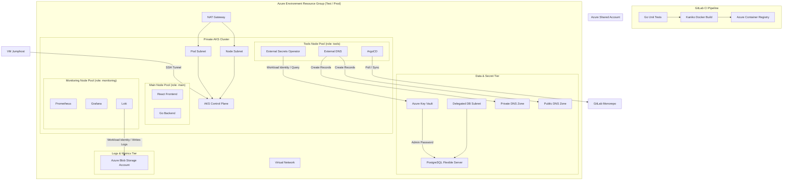

# Voyager's architectural diagram

This Mermaid diagram represents the **GitOps-based Azure Kubernetes architecture** project called **Voyager** with a secure CI/CD pipeline, network segmentation, workload identities, and observability. Below is the complete documentation for the architecture.

---

## Azure Kubernetes GitOps Architecture Explanation

This architecture illustrates a secure, production-oriented deployment platform hosted on Microsoft Azure. It follows modern cloud-native practices by separating responsibilities across CI/CD, networking, compute, secrets management, monitoring, and application deployment.

### 1. Continuous Integration (CI) Pipeline

The deployment process begins in the **GitLab CI Pipeline**.

When a developer pushes code to the GitLab monorepo, the pipeline automatically executes **Go unit tests** to verify application correctness before deployment. Successful tests trigger a **Kaniko Docker Build**, which builds container images without requiring a privileged Docker daemon, making it suitable for Kubernetes-based CI environments.

After the image is built, it is pushed to the **Azure Container Registry (ACR)**. ACR serves as the central private image repository from which the Kubernetes cluster later retrieves application images.

**Purpose**

* Validate source code automatically
* Build immutable container images
* Store versioned images securely in Azure

---

### 2. Azure Shared Account

The **Azure Container Registry** is hosted in a shared Azure subscription or shared services account.

Separating ACR from individual environments (such as Test and Production) enables multiple Kubernetes clusters to consume the same trusted container images while simplifying image management and reducing duplication.

**Purpose**

* Centralized container image storage
* Shared across multiple environments
* Improves consistency and governance

---

### 3. Azure Environment Resource Group

Each environment (for example, Test or Production) resides inside its own Azure Resource Group.

This resource group contains all infrastructure required to operate an isolated Kubernetes environment.

The separation between environments improves security, simplifies resource management, and reduces the risk of accidental cross-environment changes.

---

### 4. Virtual Network and Network Segmentation

The entire environment is deployed within a single **Azure Virtual Network (VNet)**.

The network is divided into dedicated subnets to isolate workloads according to their responsibilities.

#### Node Subnet

The Node Subnet contains the Kubernetes worker nodes (Virtual Machines) that execute application pods.

#### Pod Subnet

The Pod Subnet provides IP addresses directly to Kubernetes pods using Azure CNI networking.

This separation provides:

* Improved security boundaries
* Better IP address management
* Simplified network policies
* Easier troubleshooting

---

### 5. NAT Gateway

A centralized **NAT Gateway** provides outbound internet connectivity for both the Node Subnet and Pod Subnet.

Rather than assigning public IP addresses to individual nodes, all outbound traffic leaves through the NAT Gateway.

This design:

* Reduces public exposure
* Provides predictable outbound IP addresses
* Simplifies firewall whitelisting
* Improves network security

---

### 6. Private Azure Kubernetes Service (AKS)

The Kubernetes cluster is deployed as a **Private AKS Cluster**.

Unlike a public AKS deployment, the Kubernetes API server is not accessible from the Internet. Instead, it can only be reached from inside the Azure Virtual Network.

This significantly reduces the attack surface by eliminating public access to the Kubernetes control plane.

---

### 7. Node Pools

The cluster is divided into multiple node pools, each dedicated to a specific workload category.

#### Main Node Pool

The Main Node Pool hosts the business applications.

It contains:

* React Frontend
* Go Backend

Separating applications from infrastructure services prevents resource contention and enables independent scaling.

---

#### Tools Node Pool

Infrastructure management components run on a dedicated Tools Node Pool.

These include:

**ArgoCD**

ArgoCD continuously monitors the Git repository for configuration changes and synchronizes the Kubernetes cluster to match the desired state.

This implements the GitOps deployment model.

**External Secrets Operator (ESO)**

ESO retrieves secrets directly from Azure Key Vault using Azure Workload Identity instead of storing secrets inside Git repositories or Kubernetes manifests.

**External DNS**

External DNS automatically creates and updates DNS records whenever Kubernetes services or ingress resources are created.

Running these tools separately improves cluster organization and operational reliability.

---

#### Monitoring Node Pool

Observability components are isolated into their own Monitoring Node Pool.

These include:

* Prometheus
* Grafana
* Loki

Keeping monitoring infrastructure separate prevents telemetry workloads from affecting application performance.

---

### 8. Data and Secrets Tier

Infrastructure services supporting the applications are grouped together.

#### PostgreSQL Flexible Server

The managed PostgreSQL database resides inside its own delegated subnet.

Subnet delegation allows Azure Database for PostgreSQL to integrate securely into the virtual network without exposing the database publicly.

---

#### Azure Key Vault

Azure Key Vault securely stores:

* Database passwords
* API keys
* Certificates
* Connection strings

Applications never store secrets directly inside container images or source code.

Instead, secrets are retrieved dynamically using Azure Workload Identity.

---

#### Private DNS Zone

Private DNS provides internal name resolution for Azure resources that are accessible only within the virtual network.

Examples include:

* AKS private API endpoint
* PostgreSQL private endpoint

---

#### Public DNS Zone

Public DNS exposes only externally accessible services, such as application ingress endpoints.

External DNS automatically manages these records.

---

### 9. Logs and Metrics Tier

Application logs generated inside Kubernetes are collected by **Loki** and stored in an **Azure Blob Storage Account**.

Blob Storage provides:

* Durable storage
* Low operational cost
* Long-term log retention
* Scalability

Grafana later queries Loki to visualize application logs.

---

### 10. Operational Workflows

Several important operational flows are represented by the arrows in the diagram.

#### Administrator Access

Administrators connect to a hardened **VM Jumphost** using SSH.

From this trusted machine they securely access the private Kubernetes API.

Because the AKS control plane is private, direct Internet access is impossible.

---

#### GitOps Deployment

ArgoCD continuously polls the GitLab repository.

Whenever Kubernetes manifests change:

1. ArgoCD detects the change.
2. It compares the desired state stored in Git with the live cluster.
3. It synchronizes the cluster automatically.

This ensures Git remains the single source of truth.

---

#### Secret Management

External Secrets Operator authenticates using Azure Workload Identity.

Instead of using stored credentials, Azure issues temporary tokens that allow ESO to retrieve secrets securely from Azure Key Vault.

This eliminates the need for static credentials inside Kubernetes.

---

#### Database Credentials

Azure Key Vault stores the PostgreSQL administrator password.

Applications retrieve credentials dynamically rather than embedding them into deployment manifests.

---

#### DNS Automation

External DNS monitors Kubernetes ingress resources.

Whenever a new service is deployed, it automatically creates or updates DNS records in both the Public DNS Zone and the Private DNS Zone.

This removes the need for manual DNS management.

---

#### Log Storage

Loki authenticates with Azure Blob Storage using Azure Workload Identity.

Application logs are securely written to Blob Storage for centralized retention and later visualization through Grafana.

---

## Overall Architecture Summary

This architecture follows several cloud-native common practices:

* **GitOps** using ArgoCD ensures Kubernetes deployments are declarative and version controlled.
* **Private networking** minimizes public exposure by hosting the AKS control plane and supporting services inside a virtual network.
* **Network segmentation** isolates compute, data, and infrastructure workloads across dedicated subnets and node pools.
* **Azure Workload Identity** replaces static credentials with short-lived Azure-issued tokens, improving security.
* **Centralized secrets management** through Azure Key Vault prevents sensitive information from being stored in source code or Kubernetes manifests.
* **Automated DNS management** with External DNS reduces operational overhead.
* **Centralized observability** using Prometheus, Grafana, and Loki provides comprehensive monitoring, metrics, and log analysis.
* **Scalable container image management** through Azure Container Registry supports consistent deployments across multiple environments.

Overall, the design demonstrates a secure, scalable, and maintainable Azure Kubernetes platform that aligns with modern DevOps, GitOps, and cloud security best practices for enterprise production environments.
