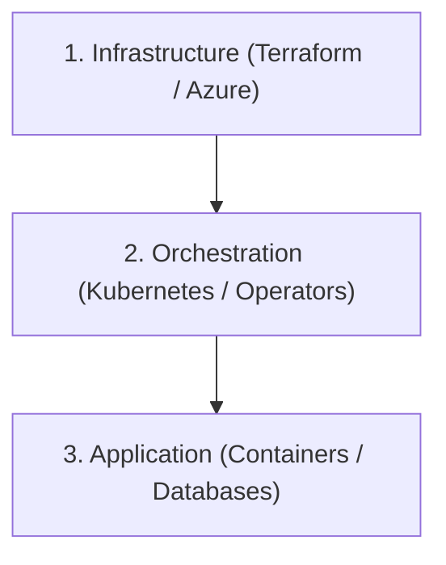

# Voyager Cloud & DevOps Debugging Handbook

This handbook serves as a diagnostic guide for managing, troubleshooting, and debugging cloud-native infrastructure built with Terraform, Azure, Kubernetes, and GitOps (ArgoCD).

---

## 🛠️ The 3-Tier Debugging Workflow

When an issue occurs, always trace it starting from the lowest infrastructure level to the highest application level:



---

## 📁 Part 1: Azure CLI & Terraform Diagnostic Guide

### 1. Common Terraform Commands

| Command | Purpose | When to Use |
|---|---|---|
| `terraform fmt -recursive` | Formats all code blocks | Before committing changes |
| `terraform validate` | Checks for syntax/compilation errors | To verify code is valid |
| `terraform plan` | Shows proposed changes (dry run) | To preview changes safely |
| `terraform apply` | Provisions live infrastructure | To deploy changes to the cloud |
| `terraform destroy` | Tears down all resources | To stop all billing charges |
| `terraform state list` | Shows all resources tracked in state | To find resource resource IDs |

---

### 2. Troubleshooting Common Terraform Errors

#### Error A: State Lock Denied
* **The Symptom**:
  ```text
  Error: Error acquiring the state lock
  Error message: Principal ... does not have permission to write blob tfstate
  ```
* **Why it happens**: Another developer (or a running CI/CD pipeline) is currently executing an apply/plan, OR a previous run crashed before releasing the lock on the blob storage.
* **How to fix**: 
  If you are certain no one else is running a command, force-unlock the state. First, find the **Lock Info ID** in the error output, then run:
  ```bash
  terraform force-unlock <LOCK_ID>
  ```

#### Error B: Resource Already Exists
* **The Symptom**:
  ```text
  Error: A resource with the ID "/subscriptions/.../providers/.../my-resource" already exists - to be managed via Terraform this resource needs to be imported into the State.
  ```
* **Why it happens**: You manually created a resource in the Azure Portal, or a previous Terraform state file was lost, so Azure has the resource but Terraform's blueprint file doesn't track it.
* **How to fix**: Import the resource into the state using its exact Azure resource ID:
  ```bash
  terraform import <TERRAFORM_ADDRESS> <AZURE_RESOURCE_ID>
  ```
  *Example:*
  ```bash
  terraform import module.keyvault.azurerm_key_vault.main /subscriptions/16ae35b8-3311-486c-b92e-edfd46b1e826/resourceGroups/voyager-test-rg/providers/Microsoft.KeyVault/vaults/voyager-test-kv-60d48676
  ```

#### Error C: Key Vault Access Policy Conflicts
* **The Symptom**: Your `azurerm_key_vault_access_policy` resources keep getting deleted during the next `terraform apply`.
* **Why it happens**: Mixing inline `access_policy` blocks inside the `azurerm_key_vault` resource definition with separate `azurerm_key_vault_access_policy` resource blocks causes state drift conflicts.
* **How to fix**: Always use **only** separate `azurerm_key_vault_access_policy` resources and delete the inline `access_policy {}` block from the KV resource definition entirely.

---

## ☸️ Part 2: Kubernetes (kubectl) Troubleshooting Recipes

### 1. General Diagnostic Command Cheatsheet

```bash
# Get resource lists
kubectl get nodes                # Check cluster machine health
kubectl get pods -A              # View all running apps across all namespaces
kubectl get svc -A               # List all service IPs and load balancers
kubectl get ingress -A           # List all domain mappings and external IPs

# Deep-dive descriptions (The most important debugging tool!)
kubectl describe pod <POD_NAME> -n <NAMESPACE>
kubectl describe node <NODE_NAME>

# Read container logs
kubectl logs <POD_NAME> -n <NAMESPACE> --tail=100
kubectl logs -l app=<LABEL> -n <NAMESPACE> -c <CONTAINER_NAME> --tail=50
```

---

### 2. Diagnostic Flowchart for Pod Failures

When a pod is not in the `Running` state, check its `STATUS` and follow these steps:

```
                  ┌───────────────────────────────┐
                  │   What is the Pod Status?     │
                  └──────────────┬────────────────┘
                                 │
         ┌───────────────────────┼────────────────────────┐
         ▼                       ▼                        ▼
┌─────────────────┐     ┌─────────────────┐      ┌──────────────────┐
│   Pending       │     │ ImagePullBackOff│      │ CrashLoopBackOff │
└────────┬────────┘     └────────┬────────┘      └────────┬─────────┘
         │                       │                        │
         ▼                       ▼                        ▼
┌─────────────────┐     ┌─────────────────┐      ┌──────────────────┐
│Describe Pod to  │     │Check image tags,│      │Read pod logs to  │
│check cpu/memory │     │registry login,  │      │find application  │
│quotas & taints. │     │& secrets.       │      │crashes & config  │
└─────────────────┘     └─────────────────┘      │mismatches.       │
                                                 └──────────────────┘
```

#### Issue A: Pod Status is `Pending`
* **What it looks like**: Pod stays in `Pending` status forever.
* **Where to check**:
  ```bash
  kubectl describe pod <POD_NAME> -n <NAMESPACE>
  ```
  Look at the bottom **Events** section.
* **Common causes**:
  * **Insufficient CPU/Memory**: The node pool does not have enough unallocated capacity to schedule the pod. You must scale up the node pool or reduce pod resource limits.
  * **Node Taints**: The pod does not have a toleration for taints applied to the nodes (e.g. trying to schedule an app pod on a tools-only pool).

#### Issue B: Pod Status is `ImagePullBackOff` or `ErrImagePull`
* **What it looks like**: Pod fails to pull the Docker container image.
* **Where to check**:
  ```bash
  kubectl describe pod <POD_NAME> -n <NAMESPACE>
  ```
  Check the **Events** section for the explicit registry error message.
* **Common causes**:
  * **Incorrect Image Tag**: The tag (e.g., commit SHA) does not exist in the registry. Check your pipeline.
  * **Access Denied**: The cluster does not have permissions to read from the registry. Verify that the AKS cluster managed identity has the `AcrPull` role assignment on the ACR resource.

#### Issue C: Pod Status is `CreateContainerConfigError`
* **What it looks like**: Container configuration is invalid.
* **Where to check**:
  ```bash
  kubectl describe pod <POD_NAME> -n <NAMESPACE>
  ```
* **Common causes**:
  * **Missing ConfigMap or Secret**: The pod's container references environment variables from a ConfigMap or Secret that has not been created in that namespace yet. Verify the secrets using `kubectl get secret -n <NAMESPACE>`.

#### Issue D: Pod Status is `CrashLoopBackOff`
* **What it looks like**: The pod pulls the image and starts, but the process inside immediately exits or crashes.
* **Where to check**:
  ```bash
  kubectl logs <POD_NAME> -n <NAMESPACE> --previous
  ```
  *Note: Using the `--previous` flag prints logs from the container that just crashed, which is vital since the current running logs are empty.*
* **Common causes**:
  * **Application configuration errors**: Missing required environment variables.
  * **Database Connection Failure**: The database host is unreachable, DNS is wrong, or the database rejected connection credentials/SSL mode.

---

## 🐙 Part 3: ArgoCD & GitOps Troubleshooting

ArgoCD maintains the synchronization loop. When things go wrong in ArgoCD, check the following states:

### 1. App shows `OutOfSync`
* **Why**: The configuration in Git is newer or different from what is currently deployed in the cluster.
* **How to fix**: 
  * Click the **Sync** button in the ArgoCD UI, or run a hard sync via the terminal:
    ```bash
    kubectl patch application <APP_NAME> -n argocd --type merge -p '{"metadata":{"annotations":{"argocd.argoproj.io/refresh":"hard"}}}'
    ```
  * If it fails to sync, click on the **Diff** tab in the UI to see what fields conflict.

### 2. App shows `Degraded`
* **Why**: The resources synced successfully, but their internal health checks failed (e.g. a Deployment's pods are crashlooping, or an Ingress lacks a public load balancer IP address).
* **How to fix**:
  1. Click into the application card to find which specific resource has a red/unhealthy icon.
  2. Use `kubectl describe` and `kubectl logs` on that specific resource to diagnose.

---

## 🔒 Part 4: Secrets Management (External Secrets) Troubleshooting

External Secrets Operator (ESO) bridges Azure Key Vault and Kubernetes. If secrets are not sync'd, diagnose the pipeline step-by-step:

```
┌────────────────┐      ┌────────────────────┐      ┌──────────────────┐
│ Azure Key Vault│ ──►  │ ClusterSecretStore │ ──►  │  ExternalSecret  │
└────────────────┘      └────────────────────┘      └──────────────────┘
```

### 1. Check Secret Store Health
```bash
kubectl get clustersecretstores
```
* **Status matches `InvalidProviderConfig`**: Check `kubectl describe clustersecretstore <STORE_NAME>`. Ensure you specified the correct `tenantId` and `vaultUrl` (with lowercase casing: `azurekv:` instead of `azureKV:`).
* **Status matches `Valid` (True)**: The operator successfully authenticated with Azure!

### 2. Check External Secret Synced Status
```bash
kubectl get externalsecrets -n <NAMESPACE>
```
* **Status matches `SecretSyncedError`**: Check the logs:
  ```bash
  kubectl describe externalsecret <SECRET_NAME> -n <NAMESPACE>
  ```
* **Common errors**:
  * **`keyvault.BaseClient#GetSecret: StatusCode=403 Forbidden`**: The User-Assigned Managed Identity of the operator does not have Access Policy permissions on Key Vault secrets. Verify that you deployed the Key Vault access policy for the identity's principal ID.
  * **`secret not found`**: The secret name requested in the `ExternalSecret` manifest does not exist inside Azure Key Vault. Verify the secret name spelling inside the Azure Portal key vault.

### 3. Force Secret Reconciliation
External Secrets cache values. If you updated a key inside Key Vault and want to force an immediate refresh in Kubernetes without waiting for the default 1-hour interval, run:
```bash
kubectl annotate externalsecret <SECRET_NAME> force-sync=$(date +%s) -n <NAMESPACE> --overwrite
```
